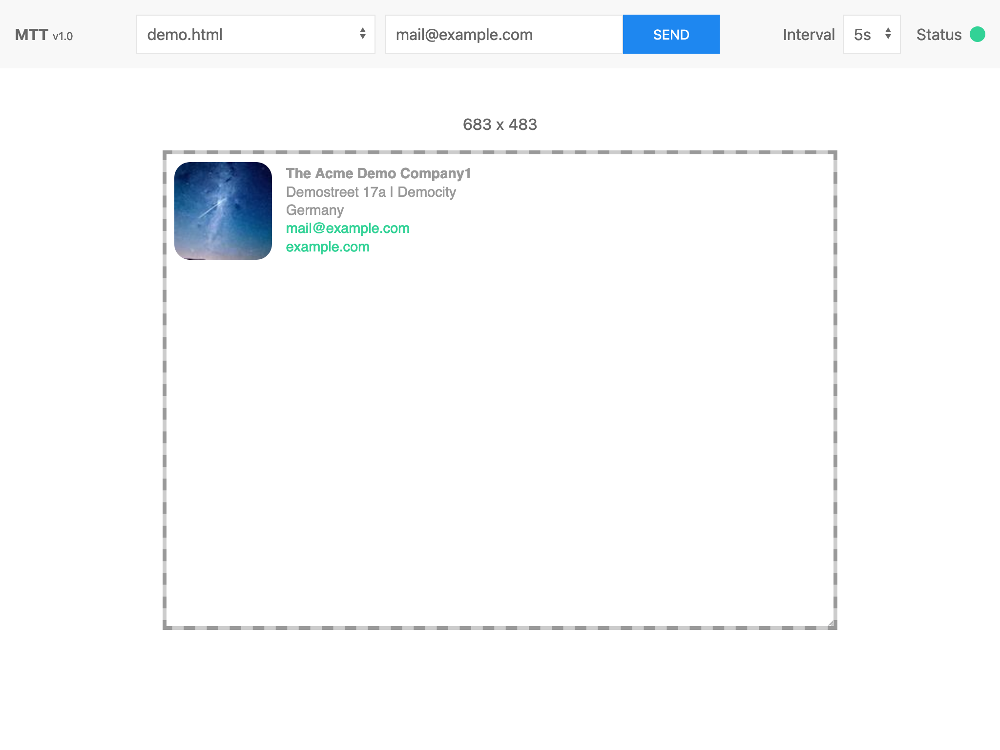

# MailTemplateTester

## What's this?
The MailTemplateTester (MTT) is small PHP / JS application – intended for running on a local development server such as MAMP, XAMPP etc. – to speed up the development and testing of email templates or email signatures.

It provides live-reload of your template file (HTML), similar to the _Live Server_ Extensions for VS Code and allows sending of test emails right out of the preview window. So you may easily test your changes in real-world mail clients without copying & pasting your HTML to another application or service.

## Features
* Watches for changes in current viewed template file and live reloads thw preview
* Resizeable preview area
* Send in test mails using PHP mail or SMTP

## Setup
* Copy files and folder to your local dev server
* call the URL of the folder e.g. `http://localhost/mtt`
* on the first run, a `config.php` file is created in the root of the folder
* check the `config.php` and adapt the settings to your needs
* create an HTML-File (extension `.html`) inside the `templates` folder
* reload the MTT window and start coding
